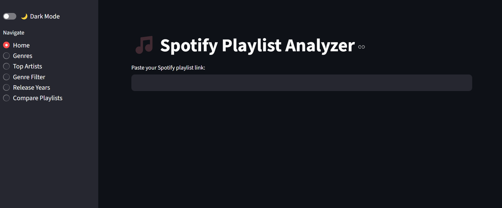

ECHO is on.
# 🎵 Spotify Playlist Analyzer

A Streamlit web app that analyzes your Spotify playlist and gives you insights on:
- 🎧 Top genres & clustered genre families
- 🎤 Most frequent artists
- 📅 Release year trends & decade breakdown
- 🎯 Filter by genre or artist
- 🔍 Compare two playlists for similarity

---

## 🚀 Live App
👉 Try it out: [https://your-username-your-repo-name.streamlit.app](https://master-bwd7xmng9bhedfkznzfwgi.streamlit.app)

---

## 🛠 Features
- 🔍 Paste a Spotify playlist link to get full breakdown
- 📊 Genre bar charts, pie charts, treemaps
- 🎼 Top 20 most frequent artists (with images & Spotify links)
- 🗂 Filter tracks by genre or artist
- 📅 See release years and decade-wise stats
- 🧠 Compare two playlists and see:
  - Artist overlap %
  - Genre overlap %
  - Overall similarity score

---

## 📦 Built With
- [Streamlit](https://streamlit.io/) – for the interactive UI
- [Spotipy](https://spotipy.readthedocs.io/en/2.22.1/) – Spotify Web API wrapper
- [Plotly](https://plotly.com/python/) – for stunning visualizations
- [Pandas](https://pandas.pydata.org/) – for data wrangling

---
